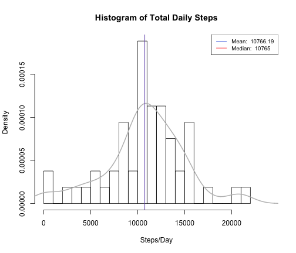
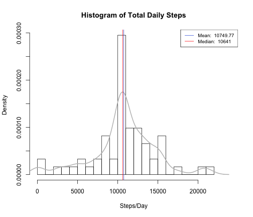
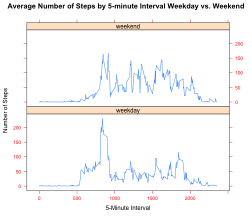

Reproducible Research Peer Assessment 1: Activity Data Analysis
===============================================================

First, we load the necessary libraries to run our analysis:


```r
library(sqldf)
```

```
## Loading required package: gsubfn
## Loading required package: proto
## Loading required namespace: tcltk
## Loading required package: RSQLite
## Loading required package: DBI
## Loading required package: RSQLite.extfuns
```

```r
library(knitr)
library(lattice) 
```

Next, we download, unzip and load the csv file into the variable, "activity":


```r
fileUrl <- "https://d396qusza40orc.cloudfront.net/repdata%2Fdata%2Factivity.zip"
temp <- tempfile()
download.file(fileUrl,temp, method="curl")

if(!exists("activity")){
  activity <- read.csv(unz(temp,"activity.csv"), header=TRUE, sep=",")
}

unlink(temp)
```

Using sqldf, we aggregate the total number of steps by day:


```r
totalStepsPerDay <- sqldf("select date, sum(steps) as total_steps
                           from activity 
                           where steps is not null
                           group by date")
```

```
## Loading required package: tcltk
```

Next, we plot a histogram of the total number of steps taken each day, labeling the mean and median daily steps:


```r
hist(totalStepsPerDay$total_steps, breaks=nrow(totalStepsPerDay)/3, freq=FALSE, main="Histogram of Total Daily Steps", xlab="Steps/Day", xlim=c(0,24000))
lines(density(totalStepsPerDay$total_steps), lwd = 2, col = "gray")

meanSteps <- mean(totalStepsPerDay$total_steps)
medianSteps <- median(totalStepsPerDay$total_steps)

abline(v = medianSteps,col = "red",lwd = 1)
abline(v = meanSteps,col = "royalblue",lwd = 1)

legend(x = "topright", c(paste("Mean: ",round(meanSteps,2)), paste("Median: ",medianSteps)), col = c("royalblue", "red"), lwd = c(1, 1), cex=0.8)
```

 

The mean total number of steps taken per day is: 

```r
cat(meanSteps)
```

10766

The median total number of steps taken per day is: 

```r
cat(medianSteps)
```

10765

Looking at the daily activity pattern, we find the average number of steps taken at each 5-minute interval. We use sqldf to perform this aggregation:

```r
avgStepsPerInterval <- sqldf("select interval, avg(steps) as avg_steps
                              from activity 
                              where steps <> 'NA'
                              group by interval")
```

We want to find the interval with the max steps, so we do this by subsetting the data set where the average number of steps by day is equal to the maximum number of steps over the entire set.

```r
maxSteps<-max(avgStepsPerInterval$avg_steps)
maxStepInterval<-subset(avgStepsPerInterval, avgStepsPerInterval$avg_steps==maxSteps)$interval
```

We then make a line plot of the resulting data, adding a vertical line to our plot indicating which 5-minute interval has the maximum number of steps:

```r
plot(avgStepsPerInterval$interval, avgStepsPerInterval$avg_steps, type="l", main="Average Steps Per 5-Minute Interval", ylab="Average Steps", xlab="5-Minute Interval")
maxSteps<-max(avgStepsPerInterval$avg_steps)
maxStepInterval<-subset(avgStepsPerInterval, avgStepsPerInterval$avg_steps==maxSteps)$interval
abline(v = maxStepInterval,col = "royalblue",lwd = 1)
legend(x = "topright", c(paste("5-Min Interval with \nMaximum Avg Steps: ",maxStepInterval)), col = c("royalblue"), lwd = c(1), cex=0.8)
```

 

We can see that the 5-minute interval with the maximum number of steps is:

```r
cat(maxStepInterval)
```

835

The presence of missing days may introduce bias into some calculations or summaries of the data. Therefore, let's see how many missing values exist in our data set. We can find this out using sqldf to count the number of values where steps is null:

```r
totalMissingVals <- sqldf("select count(1) as missingVals
                           from activity 
                           where steps is null")
```


We can see that the number of missing values is:

```r
cat(totalMissingVals$missingVals)
```

2304

Let's fill in the missing values in the data set, by using the mean number of steps for that 5-minute inverval (across all dates):

```r
intervalAvgs <- sqldf("select interval, avg(steps) as avg_steps
                       from activity
                       group by interval")

newActivity <- sqldf("select ifnull(a.steps, b.avg_steps) as steps, date, a.interval
                      from activity a, intervalAvgs b
                      where a.interval = b.interval")
```

Using sqldf, we aggregate the total number of steps by day on our new activity data set:

```r
totalStepsPerDayNew <- sqldf("select date, sum(steps) as total_steps
                           from newActivity 
                           where steps is not null
                           group by date")
```

Next, we plot another histogram of the total number of steps taken each day, this time using the new data set, labeling the mean and median daily steps:

```r
hist(totalStepsPerDayNew$total_steps, breaks=nrow(totalStepsPerDayNew)/3, freq=FALSE, main="Histogram of Total Daily Steps", xlab="Steps/Day", xlim=c(0,24000))
lines(density(totalStepsPerDayNew$total_steps), lwd = 2, col = "gray")

meanSteps <- mean(totalStepsPerDayNew$total_steps)
medianSteps <- median(totalStepsPerDayNew$total_steps)

abline(v = medianSteps,col = "red",lwd = 1)
abline(v = meanSteps,col = "royalblue",lwd = 1)

legend(x = "topright", c(paste("Mean: ",round(meanSteps,2)), paste("Median: ",medianSteps)), col = c("royalblue", "red"), lwd = c(1, 1), cex=0.8)
```

 

The mean total number of steps taken per day on our new data set is: 

```r
cat(meanSteps)
```

10750

The median total number of steps taken per day on our new data set is: 

```r
cat(medianSteps)
```

10641

As can be seen, after filling in the missing values in the activity data set, the mean and median values are slightly different than before, but still very close. As we can see from the histogram, our density curve is now smoother given that days that did not have recorded activity are now filled in. The overall impact of imputing missing data on the estimates of total daily number of steps is only minor.

Let's now see if there are differences in activity patterns between weekdays and weekends. First, we'll add a day_type variable to our data set using the weekdays() function:

```r
newActivity$day_of_week <- weekdays(as.Date(newActivity$date))
newActivity <- sqldf("select steps, date, interval, day_of_week, case when day_of_week in ('Saturday','Sunday') then 'weekend' else 'weekday' end as day_type from newActivity")
```

Finally, we'll plot the average number of steps per 5-minute interval, comparing weekdays to weekends:

```r
newActivity <- sqldf("select day_type, interval, avg(steps) as avg_steps from newActivity group by day_type, interval order by day_type, interval")

xyplot<-xyplot(newActivity$avg_steps~newActivity$interval|newActivity$day_type, scales=list(cex=.8, col="red"),
   xlab="5-Minute Interval", ylab="Number of Steps", 
   type="l",
   layout=c(1,2),
   main="Average Number of Steps by 5-minute Interval Weekday vs. Weekend")

print(xyplot)
```

 
